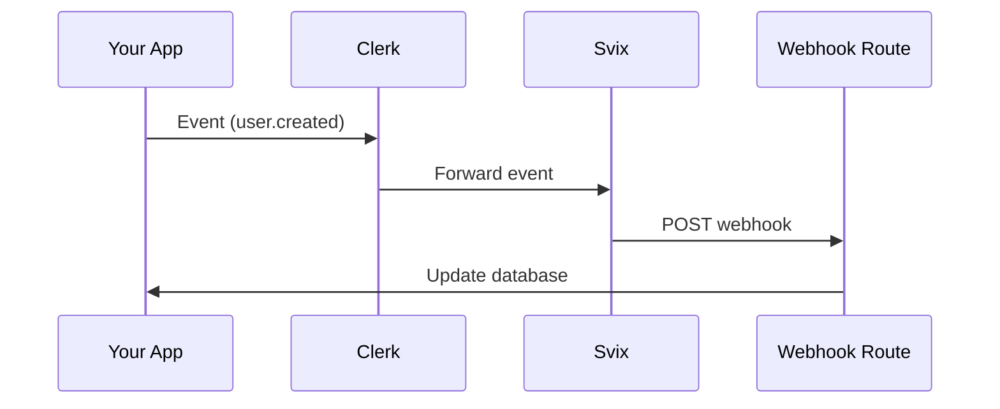

# Webhook Sync Skill

Handle Clerk webhooks to sync data to your database.

## Do You Actually Need Webhooks?

**Most apps DON'T need to sync users to a database.**

| Need | Solution |
|------|----------|
| Get current user's data | `auth()` or `useUser()` - no DB needed |
| Store app-specific data | Use `user.publicMetadata` or `user.privateMetadata` |
| Display OTHER users' info | **Yes, sync to DB** |
| Query users by custom fields | **Yes, sync to DB** |

## Framework Detection

Detect your framework, then read ONLY that README:

| Framework | Action |
|-----------|--------|
| Next.js (`next.config.*`) | Read `templates/nextjs/README.md` |
| Express (`express` in package.json) | Read `templates/express/README.md` |
| Astro (`astro.config.*`) | Read `templates/astro/README.md` |

The README contains install, gotchas, and the webhook handler template.

## Environment Variable

```bash
CLERK_WEBHOOK_SIGNING_SECRET=whsec_xxxxx
```

Get from [Clerk Dashboard](https://dashboard.clerk.com) → Webhooks.

## Webhook Flow



## Templates

| File | Description |
|------|-------------|
| `templates/nextjs/` | Next.js App Router webhook |
| `templates/express/` | Express.js webhook handler |
| `templates/astro/` | Astro API endpoint |
| `templates/db-sync.ts` | ORM-agnostic DB sync pattern |

## References

| File | Description |
|------|-------------|
| `references/events.md` | All webhook events + testing + debugging |

## Critical Pattern

All frameworks use `verifyWebhook`:

```typescript
import { verifyWebhook } from '@clerk/{framework}/webhooks';

const evt = await verifyWebhook(req);
// evt.type, evt.data are now verified
```

## Documentation

- [Webhooks Overview](https://clerk.com/docs/webhooks/overview)
- [Sync Data Guide](https://clerk.com/docs/webhooks/sync-data)
