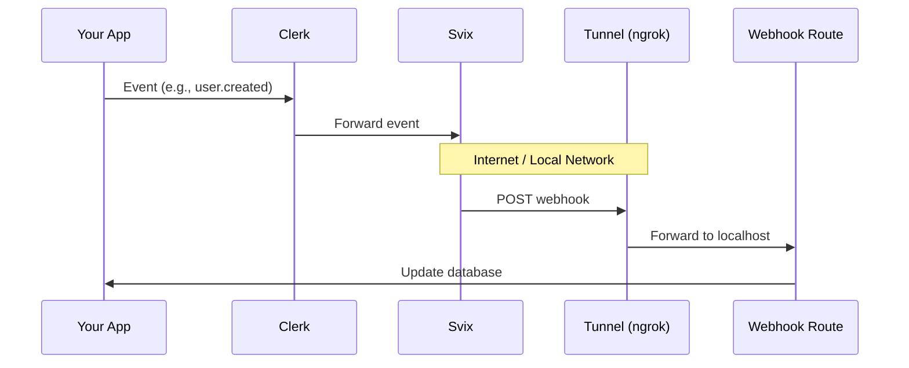

# Webhook Sync Skill

Handle Clerk webhooks to sync data to your database. This skill covers **when** to sync, **how** to verify, and **debugging** strategies.

## Do You Actually Need Webhooks?

**Most apps DON'T need to sync users to a database.**

Clerk's session tokens already contain user data. Only sync if:

| Need | Solution |
|------|----------|
| Get current user's data | `auth()` or `useUser()` - no DB needed |
| Store app-specific data (e.g., preferences) | Use `user.publicMetadata` or `user.privateMetadata` |
| Display OTHER users' info (social features) | **Yes, sync to DB** |
| Query users by custom fields | **Yes, sync to DB** |

### When to Use Metadata vs Database

```
Metadata (< 1.2KB total):
├── publicMetadata  → Visible to user, readable client-side
├── privateMetadata → Hidden from user, server-only
└── unsafeMetadata  → User-editable, client-writable

Database (unlimited):
└── Separate table with clerk_id column
```

## Webhook Flow



## Quick Start

### 1. Set Environment Variable

Get your webhook signing secret from [Clerk Dashboard](https://dashboard.clerk.com) → Webhooks:

```bash
CLERK_WEBHOOK_SIGNING_SECRET=whsec_xxxxx
```

### 2. Create Webhook Route

The `verifyWebhook` helper works across frameworks. Import path varies:

| Framework | Import |
|-----------|--------|
| Next.js | `@clerk/nextjs/webhooks` |
| Astro | `@clerk/astro/webhooks` |
| Express | `@clerk/express/webhooks` |
| Fastify | `@clerk/fastify/webhooks` |
| Nuxt | `@clerk/nuxt/webhooks` |
| React Router | `@clerk/react-router/webhooks` |
| TanStack Start | `@clerk/tanstack-start/webhooks` |

### Next.js Example

```typescript
// app/api/webhooks/clerk/route.ts
import { verifyWebhook, type WebhookEvent } from '@clerk/nextjs/webhooks';

export async function POST(req: Request) {
  let evt: WebhookEvent;

  try {
    evt = await verifyWebhook(req);
  } catch (err) {
    console.error('Webhook verification failed:', err);
    return Response.json({ error: 'Invalid signature' }, { status: 400 });
  }

  switch (evt.type) {
    case 'user.created':
      await createUserInDB(evt.data);
      break;
    case 'user.updated':
      await updateUserInDB(evt.data);
      break;
    case 'user.deleted':
      await deleteUserFromDB(evt.data.id);
      break;
  }

  return Response.json({ received: true });
}
```

### Express Example

```typescript
import express from 'express';
import { verifyWebhook, type WebhookEvent } from '@clerk/express/webhooks';

const app = express();

app.post('/api/webhooks/clerk', async (req, res) => {
  let evt: WebhookEvent;

  try {
    evt = await verifyWebhook(req);
  } catch (err) {
    return res.status(400).json({ error: 'Invalid signature' });
  }

  // Handle event...
  res.json({ received: true });
});
```

### Astro Example

```typescript
// src/pages/api/webhooks/clerk.ts
import type { APIRoute } from 'astro';
import { verifyWebhook, type WebhookEvent } from '@clerk/astro/webhooks';

export const POST: APIRoute = async ({ request }) => {
  let evt: WebhookEvent;

  try {
    evt = await verifyWebhook(request);
  } catch (err) {
    return new Response(JSON.stringify({ error: 'Invalid signature' }), {
      status: 400,
    });
  }

  // Handle event...
  return new Response(JSON.stringify({ received: true }));
};
```

## Database Sync Pattern

The pattern is the same regardless of your ORM. Store the Clerk user ID as a foreign key:

```
Your users table:
┌─────────────────────────────────────────────┐
│ id (your primary key)                       │
│ clerk_id (unique, from evt.data.id)         │
│ email                                       │
│ name                                        │
│ ... your app-specific fields               │
└─────────────────────────────────────────────┘
```

### Generic Handler Pattern

```typescript
// Works with any ORM/database
async function createUserInDB(data: WebhookEvent['data']) {
  if (data.type !== 'user') return;

  const primaryEmail = data.email_addresses?.find(
    (e) => e.id === data.primary_email_address_id
  )?.email_address;

  await db.users.create({
    clerk_id: data.id,           // Always store this
    email: primaryEmail,
    first_name: data.first_name,
    last_name: data.last_name,
    image_url: data.image_url,
  });
}

async function updateUserInDB(data: WebhookEvent['data']) {
  if (data.type !== 'user') return;

  const primaryEmail = data.email_addresses?.find(
    (e) => e.id === data.primary_email_address_id
  )?.email_address;

  await db.users.update({
    where: { clerk_id: data.id },
    data: {
      email: primaryEmail,
      first_name: data.first_name,
      last_name: data.last_name,
      image_url: data.image_url,
    },
  });
}

async function deleteUserFromDB(clerkId: string) {
  await db.users.delete({
    where: { clerk_id: clerkId },
  });
}
```

## Webhook Events Reference

| Event | When it fires |
|-------|---------------|
| `user.created` | New user signs up |
| `user.updated` | User profile changes |
| `user.deleted` | User account deleted |
| `organization.created` | New organization created |
| `organization.updated` | Organization settings changed |
| `organization.deleted` | Organization deleted |
| `organizationMembership.created` | User joins organization |
| `organizationMembership.updated` | Member role changed |
| `organizationMembership.deleted` | User removed from organization |
| `session.created` | New session started |
| `session.ended` | Session ended |
| `session.removed` | Session revoked |

## Testing Locally

### Option 1: ngrok (Recommended)

```bash
# Terminal 1: Start your app
npm run dev

# Terminal 2: Expose localhost
ngrok http 3000
```

Add ngrok URL to Clerk Dashboard → Webhooks:
```
https://xxxx.ngrok.io/api/webhooks/clerk
```

### Option 2: localtunnel

```bash
npx localtunnel --port 3000
```

### Option 3: Clerk CLI (Coming Soon)

```bash
clerk webhooks listen --forward-to localhost:3000/api/webhooks/clerk
```

## Debugging Webhooks

### Check Clerk Dashboard

1. Go to **Webhooks** → Select your endpoint
2. View **Message Attempts** for delivery status
3. Check **Payload** for actual data sent

### Common Issues

| Symptom | Cause | Fix |
|---------|-------|-----|
| 400 errors | Wrong signing secret | Check `CLERK_WEBHOOK_SIGNING_SECRET` |
| 404 errors | Wrong endpoint URL | Verify path matches your route |
| Timeout | Handler too slow | Return 200 fast, process async |
| Missing events | Events not subscribed | Enable in Dashboard → Webhooks |

### Debug Logging

```typescript
export async function POST(req: Request) {
  let evt: WebhookEvent;

  try {
    evt = await verifyWebhook(req);
  } catch (err) {
    console.error('Verification failed:', err);
    return Response.json({ error: 'Invalid signature' }, { status: 400 });
  }

  console.log('Webhook received:', {
    type: evt.type,
    id: evt.data.id,
    timestamp: new Date().toISOString(),
  });

  // Handle event...
}
```

## Important Considerations

### 1. Webhooks are Eventually Consistent

Don't use webhooks for synchronous flows. The user might see outdated data briefly.

```typescript
// BAD: Redirect after signup expecting DB to have user
redirect('/dashboard'); // User might not exist in DB yet!

// GOOD: Use session token for immediate access
const { userId } = await auth();
// Session token is immediately available
```

### 2. Handle Idempotency

Webhooks may be delivered multiple times. Use upsert or check existence:

```typescript
// GOOD: Upsert pattern
await db.users.upsert({
  where: { clerk_id: data.id },
  create: { clerk_id: data.id, email: primaryEmail, ... },
  update: { email: primaryEmail, ... },
});
```

### 3. Return 200 Quickly

Clerk retries on non-2xx responses. For heavy processing, use a job queue:

```typescript
export async function POST(req: Request) {
  const evt = await verifyWebhook(req);

  // Queue for async processing
  await queue.add('process-webhook', { event: evt });

  // Return immediately
  return Response.json({ received: true });
}
```

### 4. Middleware Configuration

For Next.js, ensure your webhook route is NOT protected by Clerk middleware:

```typescript
// middleware.ts
import { clerkMiddleware } from '@clerk/nextjs/server';

export default clerkMiddleware();

export const config = {
  matcher: [
    // Skip webhook routes - they use their own auth (signing secret)
    '/((?!api/webhooks).*)',
  ],
};
```

## Documentation

- [Webhooks Overview](https://clerk.com/docs/webhooks/overview)
- [Sync Data Guide](https://clerk.com/docs/webhooks/sync-data)
- [Debug Webhooks](https://clerk.com/docs/webhooks/debug)
- [Webhook Events Reference](https://clerk.com/docs/webhooks/webhook-events)
